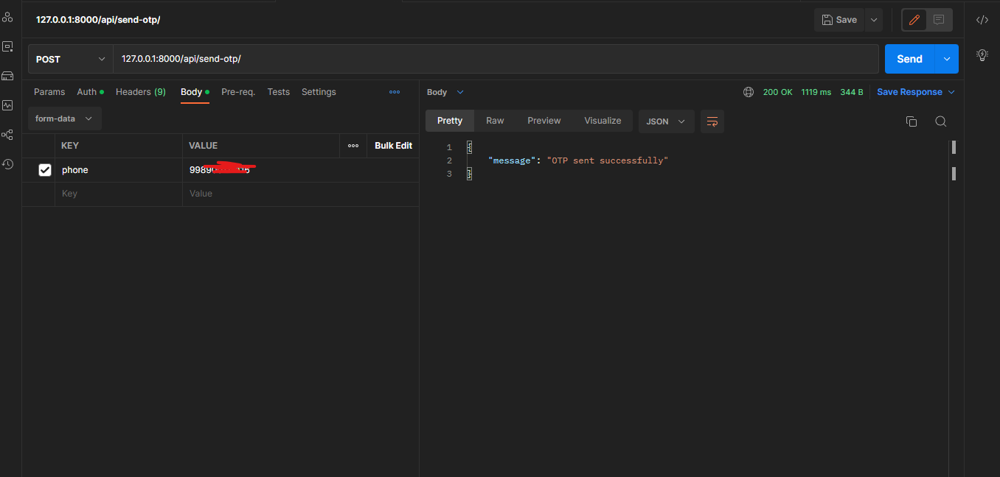
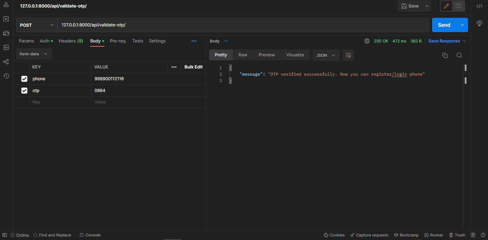
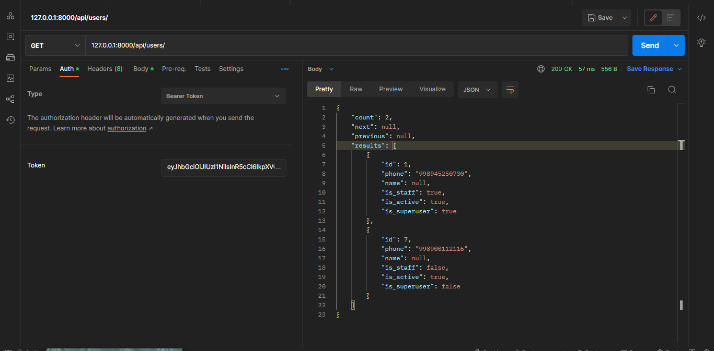
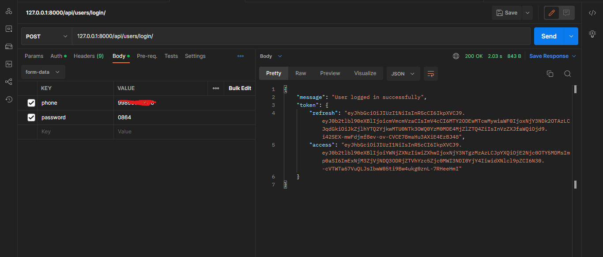
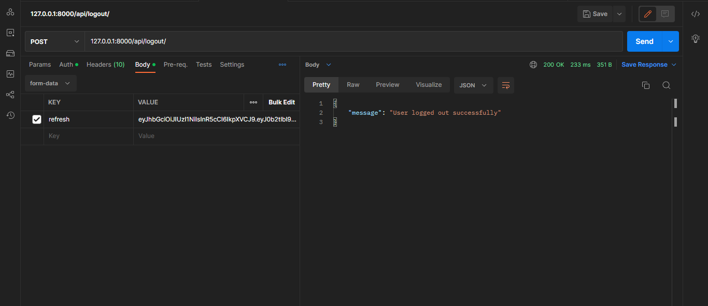

# USERS API 

### Foydalanuvchilar bilan ishlashda kerak bo'lgan metodlar
## Asosiy ENDPOINT: [https://pitak001.herokuapp.com/api/users](https://pitak001.herokuapp.com/api/users) 


## SMS yuborish
### POST /send-otp/
```json
{
    "phone": "998901234567" // Telefon raqam
}
```

### Natija



## SMSni tekshirish
### POST /validate-otp/
```json
{
    "phone": "998901234567", // Telefon raqam
    "otp": "1234" // SMS kodi
}
```
### Natija:



## GET /api/users
### Foydalanuvchilarni qaytaradi. So'rov yuborayotgan foydalanuvchi login qilingan bo'lishi kerak. Ya'ni GET so'rovi yuborayotganda so'rovga qo'shib access token yuborish kerak.
```json
{
    "headers": {
        "Authorization": "Bearer <access_token>" // Access token
        }
}
```
### Natija:


## GET /api/users/user/ 
### Foydalanuvchi haqida ma'lumot qaytaradi. So'rov yuborayotgan foydalanuvchi login qilingan bo'lishi kerak. Ya'ni GET so'rovi yuborayotganda so'rovga qo'shib access token yuborish kerak.
```json
{
    "headers": {
        "Authorization": "Bearer <access_token>" // Access token
        }
}
```
### Natija:


## Ro'yxatdan o'tish 
### POST /api/users/register/
Ro'yxatdan o'tishdan oldin sms yuboriladi. Smsni tekshirishdan keyin ro'yxatdan o'tish mumkin.

Request: 
```json
    {
        "phone": "998901234567", //required
        "password": "1234", //required
        "phone2": "998901234567", //not required
        "is_driver": false, // not required
    }
```
### Natija:


## Tizimga kirish. Login 
### POST /api/users/login/
LOGIN qilishdan oldin sms yuboriladi. Smsni tekshirishdan keyin login mumkin.
```json
    {
        "phone": "998901234567", //required
        "password": "1234", //required
    }
```
### Natija:



## Logout
### POST /api/users/logout/
```json
    {
        "headers": {
            "Authorization": "Bearer <access_token>" // Access token
        }
    }
```
Natija:
